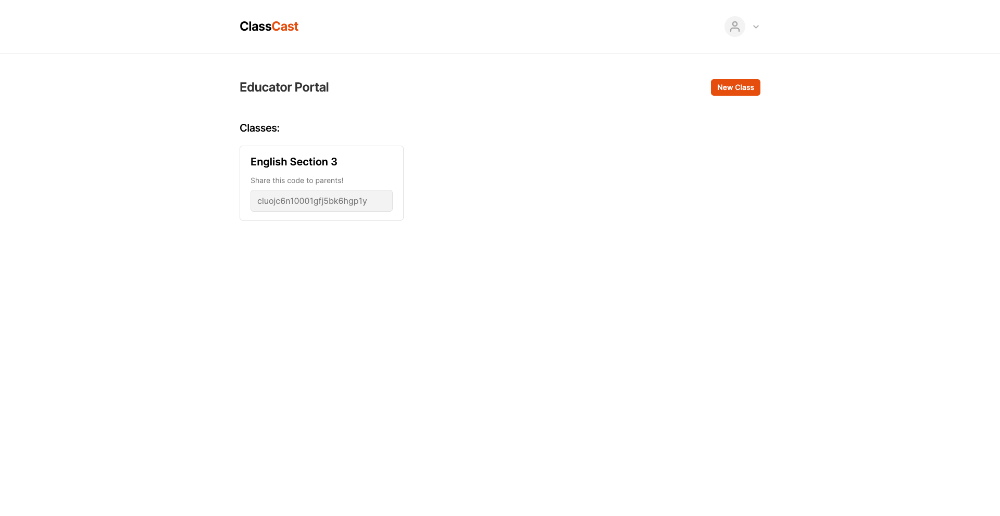

# ClassCast

Hello! This is the repo of ClassCast, created by Rohit K. for the EducateHacks Hackathon!

## Problem it tackles:
Parents usually do not know what is going on at school. This includes things like what activities are going on, as well as other things such as HW which has been assigned and opportunities for their children.

## Solution

ClassCast acts like a "connection" between the classroom and parents. Teachers are able to broad-"cast" events happening in the classroom via an "update board". They can also tag images so parents get a better idea of what is happening, and can feel more immersed and connected with their child.

## Screenshots

